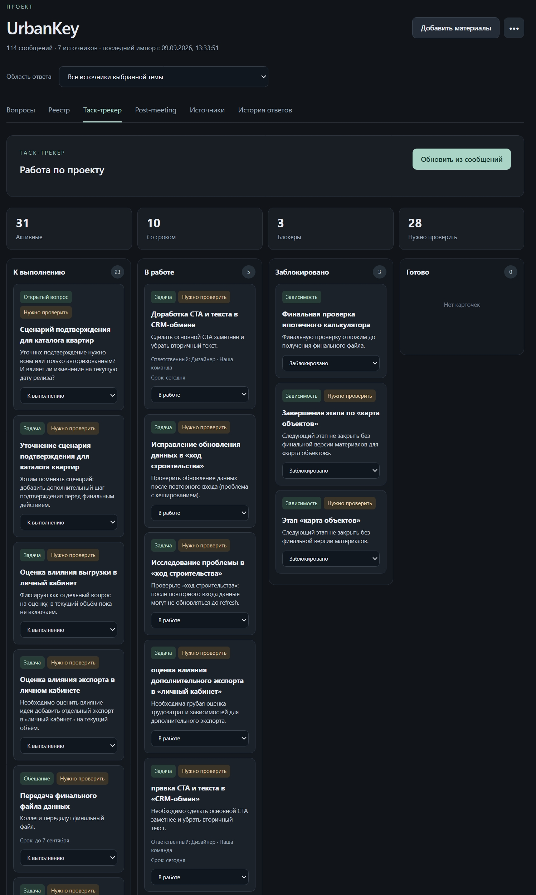
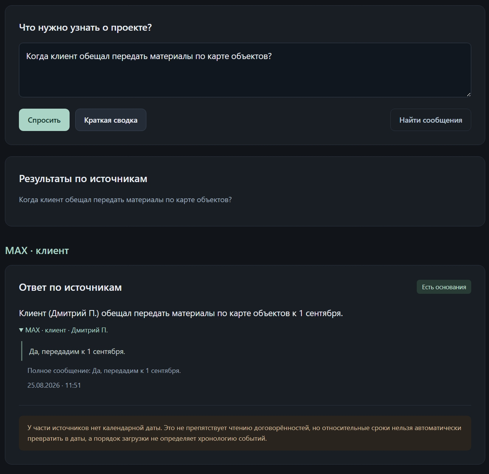
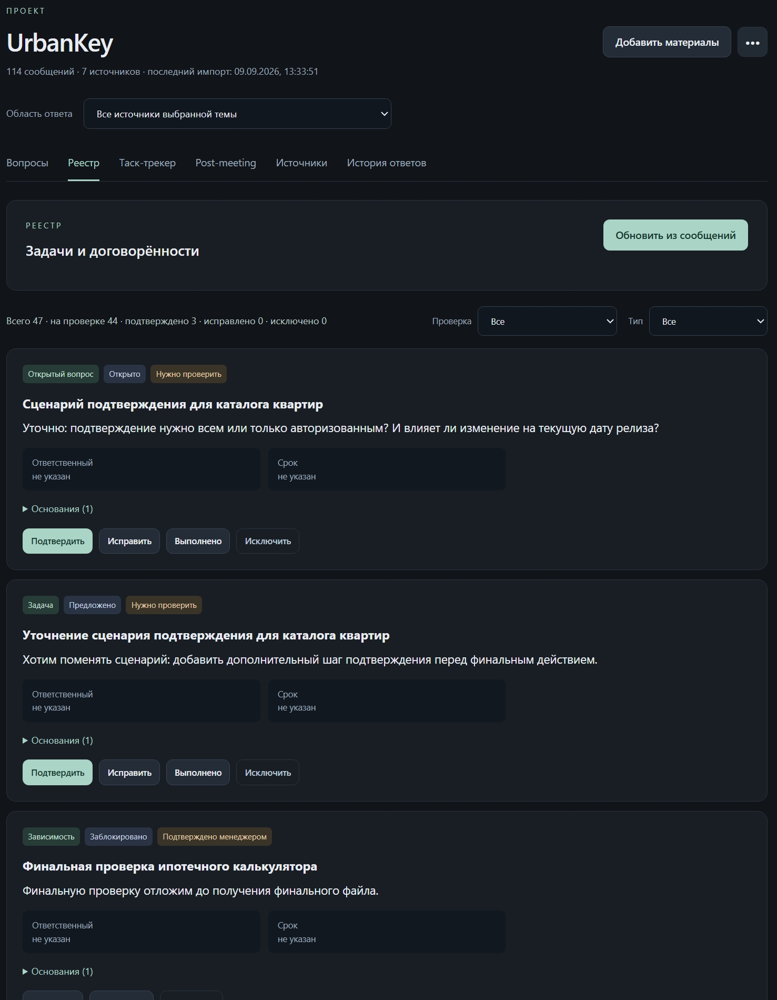
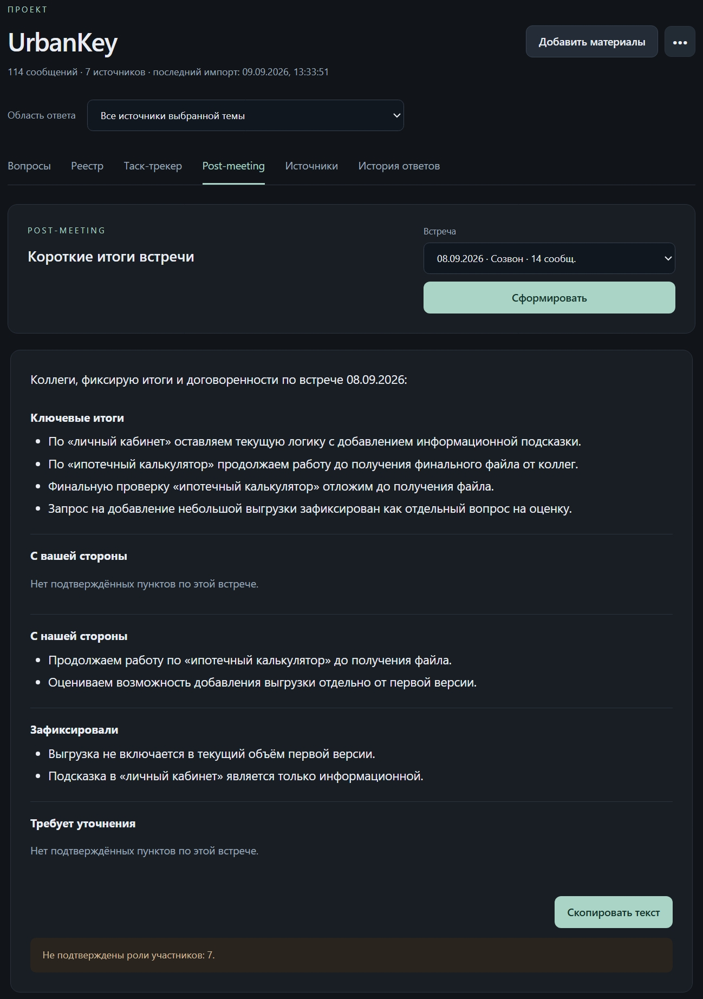
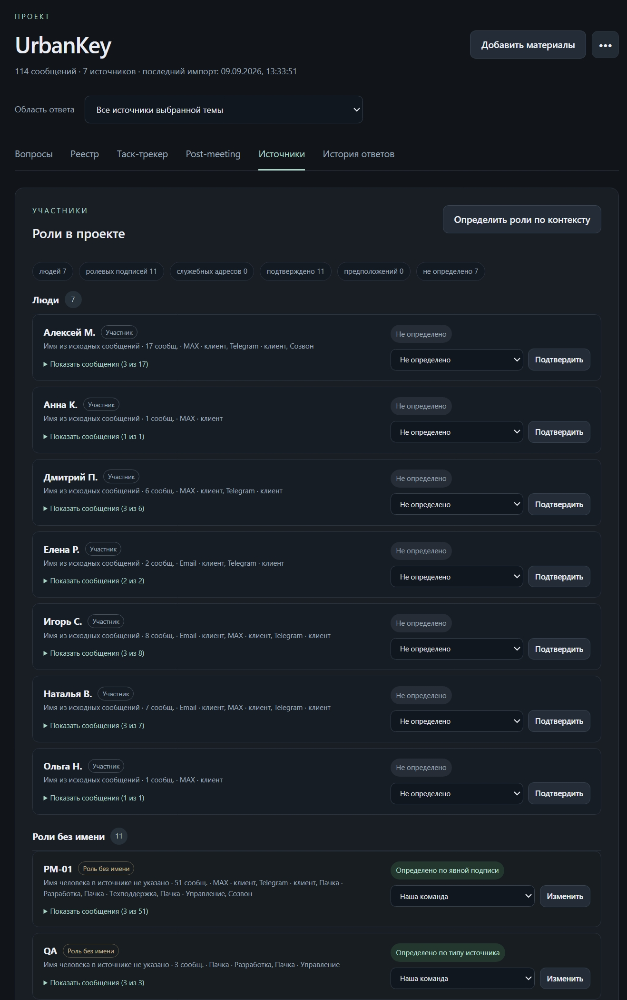

# PM Assistant
[](https://github.com/dozyanka/pm-assistant/actions/workflows/tests.yml)


**Self-hosted AI project-memory assistant for project managers.**

PM Assistant combines project communication from multiple sources, answers questions with exact source evidence, extracts tasks and agreements into a structured registry, builds a Kanban view, generates meeting-specific post-meeting drafts and keeps final business decisions under PM control.

> Developed as an independent prototype for the GigaSchool 2026 Xpage case. This repository is not an official Xpage product and contains no production Xpage/client data.
>
> Case-provided evaluation datasets are intentionally **not redistributed** in this public repository. `examples/messages_format.jsonl` is a project-owned minimal format example; fixture-dependent private regression tests are skipped when the original evaluation fixtures are absent.



## Highlights

- Source-grounded Q&A with exact message evidence.
- Project Registry: `TASK`, `DECISION`, `PROMISE`, `REQUIREMENT`, `OPEN_QUESTION`, `DEPENDENCY`.
- Separate manager-review state and business lifecycle state.
- Kanban task tracker.
- Meeting-specific post-meeting generation.
- Participant-side inference with human confirmation.
- Message revision history and answer history.
- DOCX / JSON / JSONL / TXT import flows.
- Hybrid semantic + lexical retrieval.
- Complete-history chunking for registry extraction.
- Local/self-hosted model inference through Ollama.
- Local Web, Windows Desktop and Remote Server/Client modes.

## Screenshots

| Q&A with evidence | Project Registry |
|---|---|
|  |  |

| Post-meeting | Participant roles |
|---|---|
|  |  |

More screenshots are available in `docs/screenshots/`.

## AI stack

PM Assistant intentionally uses two specialized local models:

- `qwen3.5:9b` - language analysis, structured extraction and generation.
- `qwen3-embedding:0.6b` - semantic embeddings for retrieval.

The model weights are **not** committed to Git and are not bundled in source releases.

## Architecture

```text
Web / Windows Desktop / Remote Client
                 |
                 v
        Python HTTP backend
          /             \
         v               v
      SQLite           Ollama
 project memory     local AI runtime
                      /       \
                     v         v
                Qwen 9B    Embeddings
```

The LLM is not treated as a database. Significant generated claims are linked back to original messages and pass application-level validation before they are shown or persisted.

See [docs/architecture.md](docs/architecture.md) for the processing pipeline.

## Three run modes

| Mode | AI + database | User interface |
|---|---|---|
| Local Web | same PC | browser at `127.0.0.1:8765` |
| Windows Desktop | same PC | packaged desktop window |
| Remote Server/Client | server PC | private Windows client / browser app window |

All three modes use the same core Python package and business logic.

## Requirements

- Windows 10/11 for the provided scripts/builds.
- Python 3.13 for source/development mode.
- Ollama installed locally on the AI host.
- `qwen3.5:9b`.
- `qwen3-embedding:0.6b`.
- Optional: Tailscale for Remote mode.

## Quick start from source

Clone the repository and enter it:

```bat
git clone https://github.com/dozyanka/pm-assistant.git
cd pm-assistant
```

Create a Python environment:

```bat
py -3.13 -m venv .venv
.venv\Scripts\python.exe -m pip install --upgrade pip
```

Install/pull the AI models once:

```bat
ollama pull qwen3.5:9b
ollama pull qwen3-embedding:0.6b
```

Start Ollama with the local-only settings used by the project:

```bat
scripts\windows\start_ollama.cmd
```

In a second terminal start PM Assistant:

```bat
.venv\Scripts\python.exe app.py
```

Open `http://127.0.0.1:8765`.

## Tests

The regression suite is offline: it uses fake model clients and does not download model weights.

```bat
py -3.13 -m unittest discover -s tests -v
```

The suite contains **201 regression tests** in the development tree. The public repository runs all self-contained tests; tests that require the original case-provided evaluation fixtures are automatically skipped because those fixtures are not redistributed.

## Windows builds

Desktop build:

```bat
scripts\windows\build_desktop.cmd
```

Remote Server + Client build:

```bat
scripts\windows\build_remote.cmd
```

Build outputs go to `release/` and are intentionally ignored by Git. Compiled `.exe` packages belong in GitHub Releases, not in source history.

See [docs/windows.md](docs/windows.md) and [docs/remote.md](docs/remote.md).

## Repository layout

```text
pm-assistant/
├─ pm_app/
│  ├─ services/             focused business-service modules
│  ├─ static/css/           modular web styles
│  ├─ static/js/            modular browser UI
│  ├─ db.py                 SQLite store + migrations
│  ├─ web.py                HTTP/API/auth boundary
│  ├─ ollama.py             restricted local Ollama client
│  └─ service.py            stable service facade
├─ tests/                   offline regression suite
├─ examples/                import-format examples
├─ docs/                    architecture, screenshots, deployment docs
├─ packaging/windows/       PyInstaller / Inno Setup definitions
├─ scripts/windows/         build and runtime helpers
├─ app.py                   local web entry point
├─ desktop_app.py           Windows desktop entry point
├─ remote_server.py         remote server entry point
└─ remote_client.py         remote Windows client entry point
```

## Security

The normal local server binds only to loopback. Remote mode is designed around a private Tailscale Serve endpoint instead of public router port forwarding. See [SECURITY.md](SECURITY.md) before using any non-synthetic data.

## Models and third-party software

Ollama and model weights are installed separately. See [THIRD_PARTY_NOTICES.md](THIRD_PARTY_NOTICES.md).

## Limitations / next production steps

This is a working prototype, not a finished enterprise platform. A production pilot would additionally require corporate SSO/authorization, per-project access rules, encrypted storage/backups, centralized audit logs, load testing, monitoring and approved data-retention/network policies.

## License

Project source code is provided under the [MIT License](LICENSE). Third-party software/models retain their own licenses.
